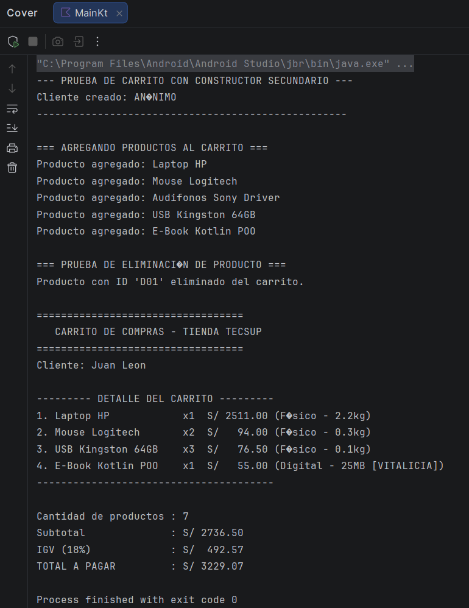

# Carrito de Compras en Kotlin - Refactorización POO

Este proyecto corresponde al **Laboratorio 02** de la tienda **TECSUP**. Se realizó una refactorización guiada desde una implementación procedural hacia una arquitectura orientada a objetos pura utilizando **Kotlin**, aplicando los 4 pilares de la POO, encapsulamiento de estado, interfaces y separación de responsabilidades.

---

## Estructura del Prompt Original y Prompts Utilizados

### Prompt Original (Inicial)
> "Hola. Actúa como un desarrollador senior en Kotlin y profesor de POO. Necesito refactorizar un proyecto de Carrito de Compras en consola. Quiero aplicar los 4 pilares de la POO (Abstracción, Encapsulamiento, Herencia y Polimorfismo), constructores (incluyendo un constructor secundario vacío por defecto), e interfaces. Por favor, guía el desarrollo paso a paso en 6 etapas para realizar 6 commits independientes en Git."

---

### Prompts Secuenciales Utilizados Paso a Paso

1. **Commit 1 (Abstracción e Interfaz Base):**
   > "Comienza dándome el código y la explicación para el Commit 1 (Interfaz y Abstracción base). Recuerda los requerimientos del dominio: Paquete `com.panez.lab02carritokotlin`, Moneda `S/`, Tienda `TECSUP`."

2. **Commit 2 (Herencia y Polimorfismo):**
   > "Ya implementé el Commit 1 e hice el push. Ahora dame el código completo, las explicaciones y las instrucciones para el Commit 2: Aplicación de Herencia y Polimorfismo con `ProductoFisico` y `ProductoDigital`."

3. **Commit 3 (Encapsulamiento del Carrito):**
   > "Ya subí el Commit 2. Dame el código completo, las explicaciones y las instrucciones para el Commit 3: La Clase `CarritoDeCompras` (Encapsulamiento y Gestión del Estado con `private val _productos`)."

4. **Commit 4 (Separación de Responsabilidades / Servicio de Reportes):**
   > "El Commit 3 está en la rama con-ia. Dame el código completo y las instrucciones para el Commit 4: Servicio de Reportes y Presentación (`ReporteService`), aplicando el principio SRP."

5. **Commit 5 (Orquestación del Sistema):**
   > "Ya subí el Commit 4. Dame el código completo y las instrucciones para el Commit 5: Integración del Punto de Entrada (`Main.kt`), agregando productos físicos, digitales, eliminación por ID y uso de `ReporteService`."

6. **Commit 6 (Documentación):**
   > "El Commit 5 corrió correctamente. Dame el contenido exacto en Markdown e instrucciones para el Commit 6: Documentación del Proyecto (`README.md`)."

---

## Historial de Commits (`git log`)

A continuación se detalla el historial de los 6 commits realizados de manera independiente en la rama `con-ia`:

| # | Commit Message | Descripción de Cambios |
|---|---|---|
| 1 | `Commit 1: Agrega interfaz Facturable y clase abstracta Producto (Abstraccion y Encapsulamiento)` | Creación de la interfaz `Facturable` (IGV 18%) y la clase abstracta `Producto`. |
| 2 | `Commit 2: Implementa subclases ProductoFisico y ProductoDigital (Herencia y Polimorfismo)` | Creación de `ProductoFisico` y `ProductoDigital` con constructores primarios y secundarios. |
| 3 | `Commit 3: Crea clase CarritoDeCompras para la gestion de lista de productos` | Implementación de `CarritoDeCompras` con lista interna privada `_productos` e inmutable `productos`. |
| 4 | `Commit 4: Implementa ReporteService para formato y presentacion en consola` | Creación del servicio `ReporteService` para desacoplar la salida en consola (SRP). |
| 5 | `Commit 5: Integra funcion principal main con flujo completo POO` | Refactorización de `Main.kt` con prueba de eliminación, constructores y polimorfismo. |
| 6 | `Commit 6: Actualiza README con explicacion POO y capturas de ejecucion` | Creación de la documentación general del proyecto y trazabilidad de IA. |

---

## Capturas de Pantalla de la Ejecución

### 1. Ejecución del Programa en Consola
