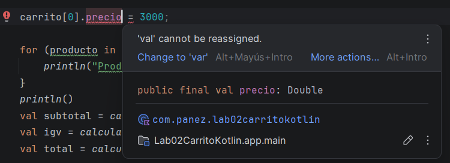
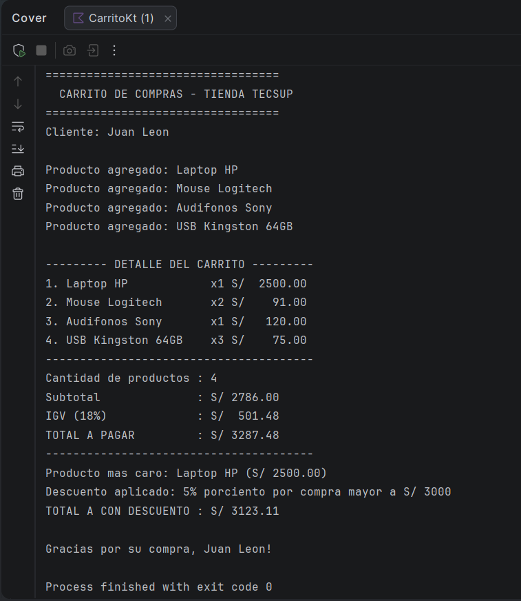

# Laboratorio 02: Carrito de compras en Kotlin

**Estudiante:** Diego Panez Rondinel 

**Curso:** Programación en Móviles

---

## 1. Descripción del Proyecto
Este proyecto simula un carrito de compras interactivo en consola desarrollado en Kotlin. Modela productos utilizando estructuras de datos inmutables y mutables, realiza cálculos financieros básicos e imprime reportes con alineación de texto.

**Funciones implementadas:**
* `calcularSubtotal`: Recorre la lista de productos y calcula la suma base.
* `calcularIGV`: Calcula el impuesto correspondiente al 18% del subtotal.
* `calcularTotal`: Suma el subtotal con el IGV para obtener el monto final.
* `mostrarDetalle`: Imprime en consola los productos agregados organizados en formato tabular.
* `calcularDescuento`: Aplica descuentos dinámicos (5% o 10%) en función del monto total de la compra usando la estructura `when`.
* Identificación del producto más caro mediante `maxByOrNull`.

---
## Respuesta Parte 2: Modelo de datos (val vs var)

* **¿Por qué nombre y precio son val pero cantidad es var?**
    * porque son propiedades inmutables, los datos base de un producto (su identificación y precio unitario) no deberían cambiar durante la sesión de compra.
    * cantidad es var porque es una propiedad mutable, ya que el usuario puede aumentar o disminuir la cantidad de unidades elegidas de ese producto dentro del carrito.

* **¿Qué pasaría si intentas cambiar el precio después de crear el producto?**
    * Ocurrirá un error de compilación ("Val cannot be reassigned"), ya que Kotlin prohíbe reasignar valores a variables o propiedades declaradas con val.
    
---

## 3. Resultado de la Ejecución

A continuación se muestra el resultado final de la consola tras procesar las compras, totales, producto más caro y descuentos aplicados:

