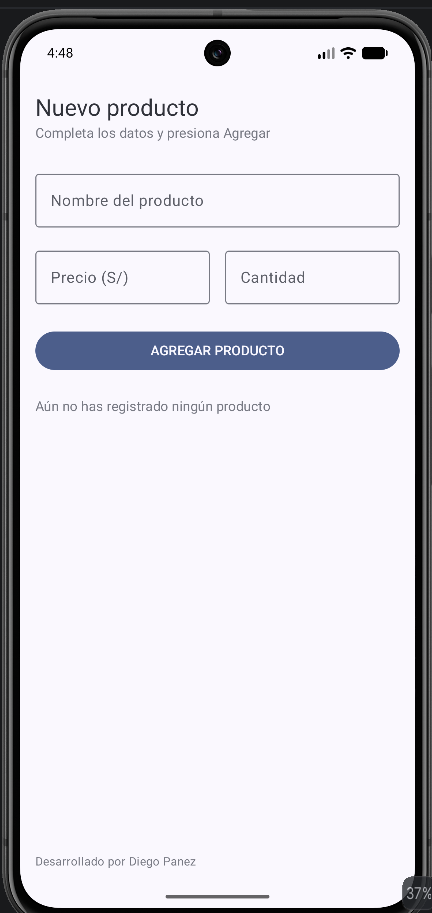
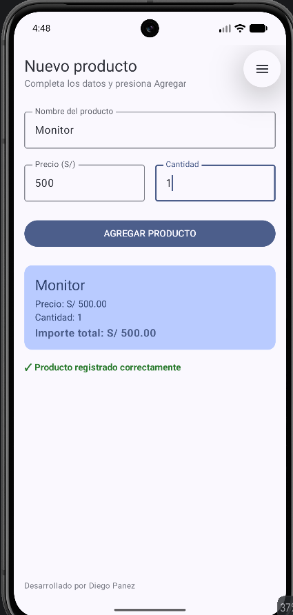

# Laboratorio 03: Registro de Producto

**Estudiante:** Diego Panez Rondinel
**Curso:** Desarrollo de Aplicaciones Móviles

## Descripción del Proyecto
Aplicación desarrollada en Android Studio utilizando Jetpack Compose que permite registrar un producto mediante campos de entrada de texto, gestionando el estado con remember y mutableStateOf, y mostrando un resumen dinámico del producto junto a su importe total.

---

## Capturas de Pantalla

### 1. Pantalla Inicial (Vacía)

### 2. Producto Registrado

---

## Pregunta de Reflexión

**¿Qué pasaría si declaras las variables de los campos SIn remember?**

Si declaras las variables sin remember (por ejemplo usando solo mutableStateOf("")), cada vez que el usuario interactúa con la pantalla (escribe una letra) se desencadena unarecomposicion  (redibujado de la interfaz). Sin remember, la función composable vuelve a ejecutarse desde el inicio y reasigna las variables a su valor inicial "".

**Resultado práctico:** El usuario no podrá escribir nada en los campos de texto porque el valor se borrará instantáneamente en cada pulsación de tecla.

---

## Historial de Commits
1. `Estructura inicial del proyecto`
2. `Agrega encabezado con jerarquia tipografica`
3. `Agrega campos de ingreso con estado`
4. `Agrega boton de accion y card de resumen`
5. `Aplica reglas de diseno y mensaje de confirmacion`
6. `Agrega README con capturas y respuesta sobre remember`