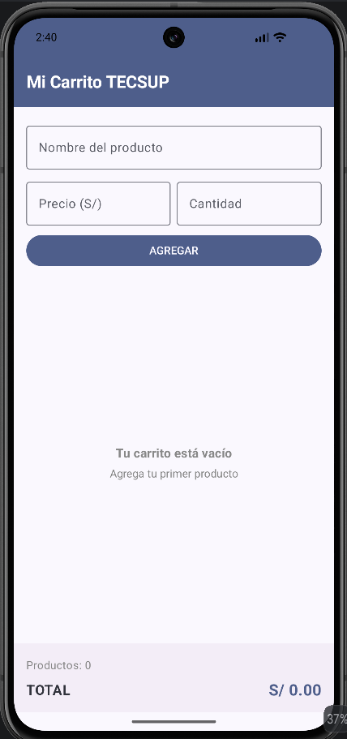
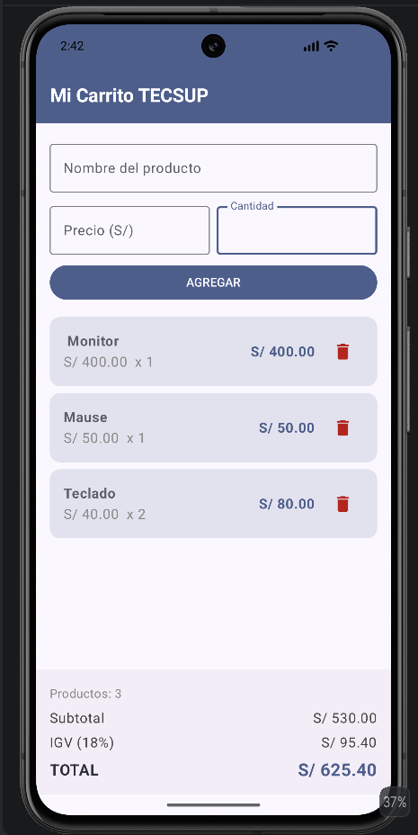

# Lab 04: Carrito de Compras TECSUP

Aplicación móvil desarrollada en Android Studio usando Kotlin y Jetpack Compose para la gestión de un carrito de compras interactivo.

---

## Respuestas a las Preguntas Conceptuales

### a) ¿Por qué se utiliza mutableStateListOf en lugar de una MutableList normal?
Se utiliza mutableStateListOf porque es una colección observable diseñada específicamente para **Jetpack Compose**.

Cuando agregamos o eliminamos elementos en una MutableList estándar de Kotlin, Compose no se entera de los cambios y la pantalla no se actualiza (no re-compone). En cambio, mutableStateListOf notifica automáticamente a la interfaz cuando la lista cambia, provocando una recomposición inmediata que refresca la lista (LazyColumn) y recalculé los totales en tiempo real.

---

### b) ¿Por qué la lista se declara con val si su contenido va a cambiar?
Se declara con val porque la referencia del objeto lista no cambia; lo que cambia es su **contenido interno** (los elementos agregados o eliminados).

En Kotlin, val evita que reasignemos la variable a un objeto totalmente nuevo (por ejemplo, productos = mutableStateListOf()), pero permite modificar los elementos almacenados dentro de la misma instancia.

---

### c) ¿Qué efecto tiene la propiedad Modifier.weight(1f) en la LazyColumn dentro del Column principal?
El modificador Modifier.weight(1f) indica a la LazyColumn que debe tomar todo el espacio vertical disponible que dejan libres los otros componentes (el formulario arriba y el panel de totales abajo).

Esto logra dos cosas fundamentales:
1. Permite que la lista sea desplazable (scrollable) sin empujar o esconder el panel de totales fuera de la pantalla.
2. Mantiene el panel de totales fijo en la parte inferior, independientemente de si la lista tiene 0, 1 o 20 productos.

### Capturas

