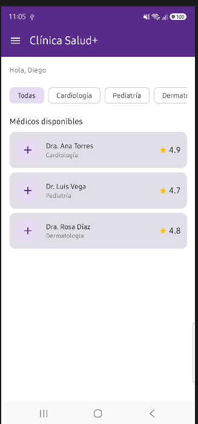
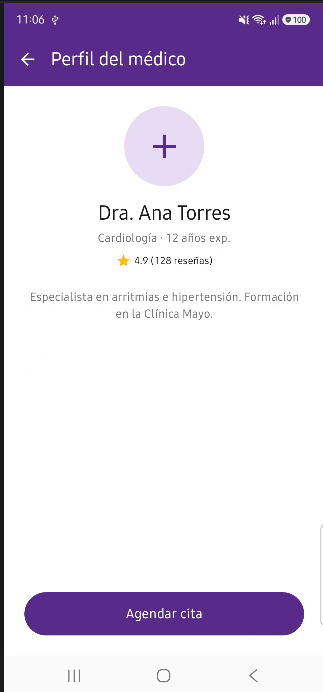
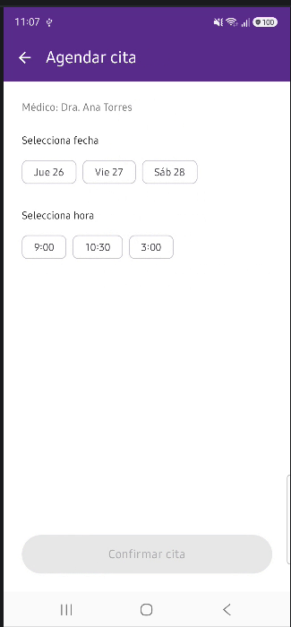
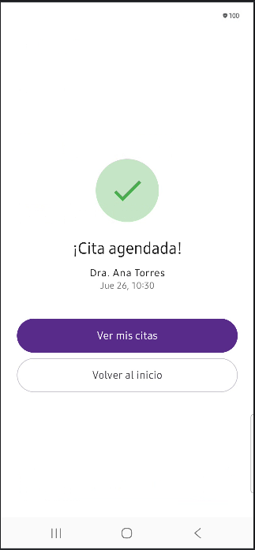
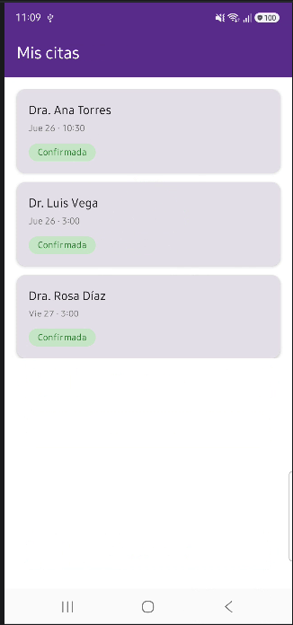

# Clínica Salud+ — Programación en Móviles

App Android con Jetpack Compose para reservar citas médicas, fase 1.

## Estructura del proyecto
```
app/src/main/java/com/panez/clinicasalud/
├── MainActivity.kt
├── model/          → Medico, Cita
├── data/           → DatosMock (listaMedicos, citasAgendadas)
├── navigation/     → AppNavegacion (NavHost con 6 rutas)
├── screens/        → Inicio, Perfil, Agendar, Confirmacion, MisCitas, Historial
└── ui/theme/       → Colores morados de la clínica
```

## Requerimientos Funcionales

| RF | Descripción | Archivo | Cómo verificarlo |
|----|-------------|---------|------------------|
| **RF1** | Filtrar médicos por especialidad | `screens/InicioScreen.kt` | Toca un chip "Cardiología" → la lista se filtra |
| **RF2** | Listar médicos disponibles | `screens/InicioScreen.kt` | Al abrir la app se ven 3 médicos con nombre, especialidad y |
| **RF3** | Ver perfil del médico seleccionado | `screens/PerfilMedicoScreen.kt` | Toca una tarjeta → se abre el perfil con datos completos |
| **RF4** | Agendar cita eligiendo fecha y hora | `screens/AgendarCitaScreen.kt` | En perfil, toca "Agendar cita" → elige chip de fecha y hora |
| **RF5** | Confirmar cita con resumen | `screens/ConfirmacionScreen.kt` | Tras confirmar, se muestra nombre del médico + fecha + hora |
| **RF6** | Navegar entre secciones con menú lateral | `screens/InicioScreen.kt` | Toca el ícono ≡ → se abre el drawer con 3 destinos |
| **RF7** | Listar citas agendadas con estado | `screens/MisCitasScreen.kt` | Drawer → "Mis citas" → lista con chip verde "Confirmada" o gris "Completada" |
| **RF8** | Ver historial de citas completadas | `screens/HistorialScreen.kt` | Drawer → "Historial médico" → muestra la cita con estado "Completada" precargada en DatosMock.kt" |
| **RF9** | Volver al inicio desde confirmación | `screens/ConfirmacionScreen.kt` | Toca "Volver al inicio" en la pantalla de confirmación |

## Flujo de navegación

**Secuencial:** Inicio → Perfil médico → Agendar cita → Confirmación
Secundaria (drawer): Inicio / Mis citas / Historial médico

---

## Uso de IA (Fase 2)

**Herramienta usada:** Gemini Agent (integrado en Android Studio)
**Modelo:** Gemini 3.6 Flash

### Prompt 1 — Cancelar cita con AlertDialog

**Prompt usado:**
Necesito agregar la funcionalidad de CANCELAR una cita en la pantalla
MisCitasScreen.kt.

Requisitos:

Cuando el usuario toque una cita con estado "Confirmada", debe aparecer
un AlertDialog de confirmación.

El diálogo pregunta "¿Cancelar esta cita?" con botones
"Sí, cancelar" (rojo) y "No".

Si el usuario confirma, la cita se elimina de citasAgendadas y la UI
se actualiza automáticamente.

Las citas con estado "Completada" NO se deben poder cancelar.

No uses ViewModel, solo remember/mutableStateOf.
Mantén el diseño actual (TopAppBar morado, Card, chip de estado).

**Respuesta de la IA:**

Gemini propuso:
- Estado var citaACancelar by remember { mutableStateOf<Cita?>(null) }
- Card(onClick = { if (cita.estado == "Confirmada") citaACancelar = cita })
- AlertDialog de Material3 al final del Scaffold
- Al confirmar: citasAgendadas.remove(citaACancelar) y cerrar el diálogo

**Correcciones que tuve que hacer:**

1. **`Card(onClick = ...)` no compilaba** en mi versión de Material3
   (error de API experimental).
    - **Solución:** reemplacé por
      `Modifier.clickable(enabled = cita.estado == "Confirmada")`
      y agregué el import `androidx.compose.foundation.clickable`.

2. **Imports incompletos** — Gemini asumió un contexto aislado y no incluía
   `com.panez.clinicasalud.data.citasAgendadas`, `model.Cita` ni `ui.theme.*`.
    - **Solución:** reintegré todos los imports del proyecto.

3. **Sintaxis del `AlertDialog`** — Gemini usó `text = { ... }` con tipado
   incorrecto.
    - **Solución:** lo ajusté a
      `text = { Text("Se eliminará la cita con ...") }`.

**Resultado final:**

La funcionalidad funciona correctamente:
- Al tocar una cita "Confirmada" se abre el `AlertDialog`
- Al confirmar "Sí, cancelar" se elimina la cita de `citasAgendadas`
- Las citas "Completadas" no responden al toque (clickable deshabilitado)

### RF10 — Cancelar cita (nuevo)

| RF | Descripción | Archivo | Cómo verificar |
|----|-------------|---------|----------------|
| **RF10** | Cancelar una cita confirmada | `screens/MisCitasScreen.kt` | Mis citas → toca cita "Confirmada" → AlertDialog → "Sí, cancelar" |

## Capturas
|   Pantalla Inicio   |   Lista de Elementos    |      Agendar cita       |     Cita confirmada     |
|:-------------------:|:-----------------------:|:-----------------------:|:-----------------------:|
|  |  |  |  |

|     Pantalla Inicio     |   Lista de Elementos    |
|:-----------------------:|:-----------------------:|
|  |  |