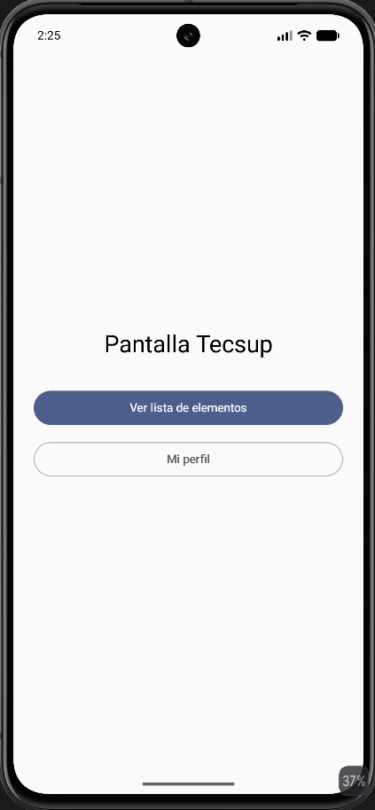
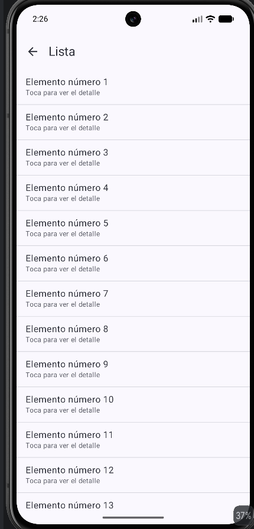
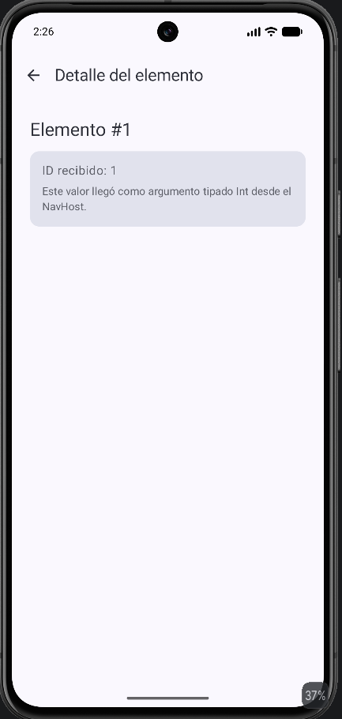
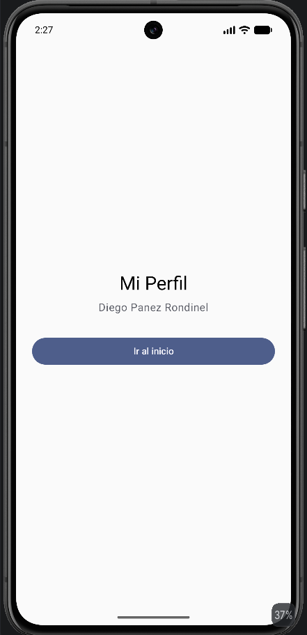

# NavLab - Aplicación de Navegación en Jetpack Compose 

Esta aplicación demuestra los conceptos fundamentales de navegación con Navigation Compose en Android, implementando paso de argumentos tipados y manejo del back stack.

---

## Requerimientos Funcionales (RF)

1. **RF01 - Menú de navegación principal:** Mostrar botones de acceso directo hacia la lista de elementos y el perfil de usuario.
2. **RF02 - Visualización de lista:** Mostrar un listado de los elementos iterables que se puedan seleccionar para ver su detalle.
3. **RF03 - Vista de detalle con identificador:** Mostrar la información y el ID del elemento seleccionado, incluyendo un botón para regresar.
4. **RF04 - Retorno desde perfil:** Permitir regresar al inicio desde el perfil limpiando el historial de navegación.
---

## 🎨 Prompt de Rediseño UI Definitivo

A continuación se detalla el prompt completo y estructurado utilizado para el rediseño estético y visual de los Composables en Jetpack Compose:

```text
Actúa como experto en UI de Jetpack Compose y Material Design 3. Rediseña las pantallas del proyecto NavLab (Login, Menú Principal, Directorio de Alumnos, Expediente Académico y Configuración de Perfil) ajustando EXACTAMENTE los siguientes detalles visuales para calcar el diseño de referencia. No modifiques la lógica de negocio, ViewModels, navegación ni fuentes de datos: solo la capa de presentación (Composables, colores, formas, tipografía y layouts).

PALETA BASE A USAR EN TODO EL PROYECTO:
• Morado oscuro: Color(0xFF4A2E83)
• Morado primario: Color(0xFF6C4AB6)
• Morado medio (acentos, carreras, links): Color(0xFF7C5CBF)
• Lavanda claro (fondos/paneles): Color(0xFFEDE7F6)
• Lavanda medio (fondo de login): Color(0xFFD9CFF0)
• Gris claro (cards de información): Color(0xFFF3EDF7)
• Blanco: Color(0xFFFFFFFF)
• Rojo/coral (cerrar sesión): Color(0xFFE05C5C)
• Gris para íconos neutros: Color(0xFF9E9E9E)
• Morado del banner de Expediente Académico: Color(0xFF5B4296)

1. PANTALLA LOGIN (HomeScreen.kt - estado no autenticado)
• Fondo de toda la pantalla: color lavanda medio sólido (0xFFD9CFF0), sin degradado.
• Card central blanca/gris muy claro (0xFFF7F6F9), esquinas redondeadas 24dp, sombra pronunciada, centrada.
• Título "Portal Académico" bold, morado oscuro, centrado, ~24sp. Subtítulo "Accede a tu cuenta" gris, centrado, debajo.
• Campo "Correo Institucional" con ícono de sobre morado a la izquierda.
• Campo "Contraseña" con ícono de candado morado a la izquierda y un trailingIcon con Icons.Default.Visibility / Icons.Default.VisibilityOff para alternar la visibilidad del texto (PasswordVisualTransformation condicional).
• Botón "INICIAR SESIÓN" morado sólido, ancho completo, esquinas full-round, texto blanco bold mayúsculas.
• Link "¿Olvidaste tu contraseña?" centrado debajo, en morado.

2. PANTALLA MENÚ PRINCIPAL (HomeScreen.kt - estado autenticado)
• Fondo: Brush.verticalGradient que empieza en morado oscuro (0xFF4A2E83) arriba y se desvanece progresivamente hacia lavanda claro/blanco (0xFFEDE7F6) abajo.
• El bloque "Bienvenido, Juan León" debe estar CENTRADO horizontalmente, con un Spacer/padding superior mayor (aprox. 56–64dp desde el borde superior, no pegado arriba) y con tamaño de fuente MÁS GRANDE (aprox. 28–30sp, bold, color blanco).
• El texto "¿Qué deseas gestionar hoy?" también centrado, debajo del saludo con un poco más de espacio del habitual (padding superior ~12–16dp), pero sin exagerar — no tan separado como el saludo.
• Dos cards blancas (Directorio de Alumnos con ícono de grupo de personas, y Mi Perfil Académico con ícono de persona), cada ícono dentro de un círculo lavanda claro, con flecha ">" morada a la derecha.
• Al final, link "Cerrar Sesión Segura" en rojo/coral centrado, con ícono de salida.

3. PANTALLA DIRECTORIO DE ALUMNOS
• Fondo general de la pantalla: blanco.
• Arriba: flecha de retroceso (←) morada + título "Directorio de Alumnos" bold morado oscuro.
• La LISTA COMPLETA de alumnos debe ir contenida dentro de un ÚNICO rectángulo/panel grande de color morado claro/lavanda (0xFFEDE7F6), con esquinas redondeadas (16–20dp) y padding interno, que envuelve visualmente a todas las tarjetas de alumnos (como un "contenedor" lavanda detrás de la lista, no solo el fondo de pantalla).
• Dentro de ese panel lavanda, cada alumno es una card individual blanca, esquinas redondeadas (16dp), separación entre ellas (8–12dp), avatar circular (ícono de persona morado sobre fondo lavanda o foto real), nombre bold negro, carrera en morado medio debajo, y flecha "›" morada a la derecha.

4. PANTALLA EXPEDIENTE ACADÉMICO (DetailScreen.kt)
• El fondo GENERAL de toda la pantalla (incluyendo el área detrás de la flecha de retroceso y el título "Expediente Académico") debe ser BLANCO puro, no morado. La barra superior con el ícono de retroceso y el título va sobre fondo blanco, con el texto e ícono en color morado oscuro (0xFF4A2E83), igual que en Directorio de Alumnos.
• Debajo de esa barra blanca, el banner/figura morada (trapecio invertido) con estas características:
  - Color sólido Color(0xFF5B4296).
  - Altura REDUCIDA: aprox. 110-130dp de alto en total (lo justo para enmarcar el avatar, no más — nada de ocupar 25-30% de la pantalla).
  - Más ANCHO/ACHATADO: la base inferior del trapecio no se angosta tanto, dando una figura corta y ancha en vez de alta y angosta.
  - Esquinas inferiores con radio LEVE/SUAVE (aprox. 24-32dp) — sutil, no un semicírculo ni curva pronunciada.
• El avatar circular va centrado horizontalmente, con la mitad superior sobre el banner morado y la mitad inferior sobre el fondo blanco (efecto overlap), bien centrado verticalmente respecto a la nueva altura reducida del banner. Borde blanco alrededor del avatar.
• El nombre (ej. "Juan León") y la carrera (ej. "Ingeniería de Sistemas") van justo debajo del avatar, centrados, sobre el fondo blanco (nombre bold negro, carrera en morado medio).
• Toda la información del estudiante (ID Estudiante, Correo Electrónico, Facultad y Biografía) debe ir dentro de UN ÚNICO contenedor/Card grande de color gris claro suave Color(0xFFF3EDF7), con esquinas redondeadas, NO en tarjetas separadas. Título de sección "INFORMACIÓN ACADÉMICA" en morado bold arriba. Cada fila con ícono en círculo lavanda a la izquierda (ícono de credencial para ID, sobre para correo, birrete/graduación para facultad), etiqueta pequeña gris arriba y valor bold abajo, separadas por HorizontalDivider sutiles. Al final, dentro del mismo contenedor, la sección "BIOGRAFÍA" con su párrafo de texto.

5. PANTALLA CONFIGURACIÓN DE PERFIL (ProfileScreen.kt)
• La barra superior (flecha de retroceso ← + título "Configuración de Perfil") debe tener FONDO BLANCO, con el ícono y el texto del título en el mismo tono morado usado en el resto de la app (0xFF6C4AB6 o 0xFF4A2E83) — NO texto blanco sobre degradado. Esta barra va separada visualmente del banner de abajo.
• Debajo de esa barra blanca, el banner con avatar y nombre lleva un degradado: Brush.horizontalGradient (diagonal) que empieza en azul/morado a la izquierda Color(0xFF4A3E85) y transiciona hacia un tono marrón/rojizo suave a la derecha Color(0xFF6B3E4A).
• Avatar circular centrado sobre este banner degradado, con borde blanco.
• Debajo del avatar, el nombre completo "Juan León Suiyon" en blanco, bold, centrado, sobre el banner degradado. Sin ninguna etiqueta tipo "Estudiante Activo" — solo el nombre.
• Debajo del banner, sobre fondo BLANCO, las secciones "INFORMACIÓN PERSONAL" y "ACADÉMICO" (título mayúsculas pequeñas, morado, bold) como LISTAS LIMPIAS sin cajas ni tarjetas individuales: cada fila tiene un ícono circular pequeño a la izquierda (fondo lavanda muy claro), pero el ÍCONO en sí debe ser de color GRIS (0xFF9E9E9E), NO morado. A la derecha: etiqueta pequeña gris arriba (ej. "Nombre Completo", "Correo", "Teléfono", "Carrera", "Ciclo Actual") y el valor en bold negro abajo. Cada fila separada por HorizontalDivider suave.
  - Íconos: persona (Nombre Completo), sobre (Correo), teléfono (Teléfono), birrete/graduación (Carrera), calendario (Ciclo Actual).
• Al final, botón "Cerrar Sesión" centrado, fondo rosado/coral muy claro, esquinas redondeadas, texto e ícono de salida en rojo/coral.

INSTRUCCIONES FINALES
1. Aplica esta paleta y tipografía de forma consistente en todas las pantallas.
2. Usa Brush.verticalGradient, Brush.horizontalGradient y Shape/clip personalizados donde se indique (banner trapecio corto y ancho en Expediente Académico, degradado diagonal en Configuración de Perfil).
3. Respeta la jerarquía: Directorio de Alumnos = panel lavanda contenedor + cards blancas dentro; Expediente Académico = fondo blanco general + banner morado trapezoidal corto/ancho con bordes suaves + card gris única con toda la info; Configuración de Perfil = barra superior blanca con texto morado + banner degradado con avatar/nombre + listas sin cajas con íconos grises.
4. No agregues pantallas ni funcionalidades nuevas.
5. Verifica que el saludo "Bienvenido, Juan León" en el Menú Principal quede centrado, más grande y con más espacio superior, y que la pregunta debajo tenga separación moderada.

## Capturas de Pantalla (Resultado Base)

|   Pantalla Inicio   | Lista de Elementos | Detalle de Elemento | Pantalla Perfil |
|:-------------------:| :---: | :---: | :---: |
|  |  |  |  |