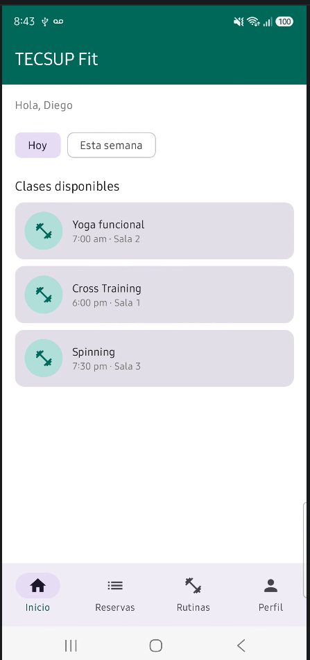
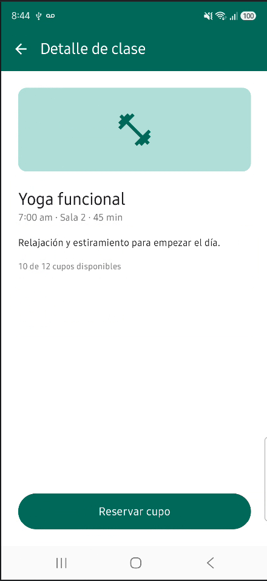
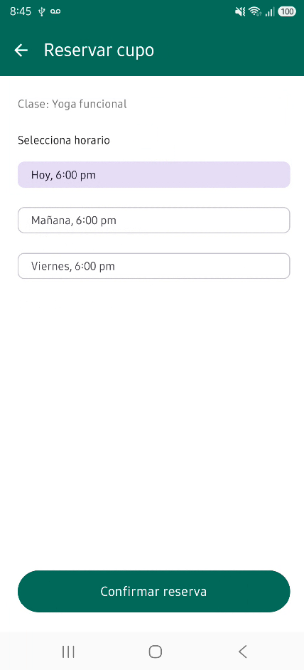
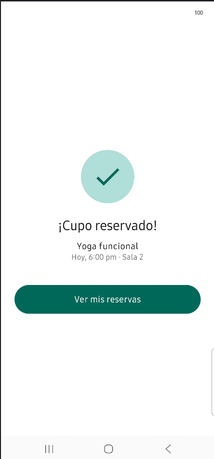
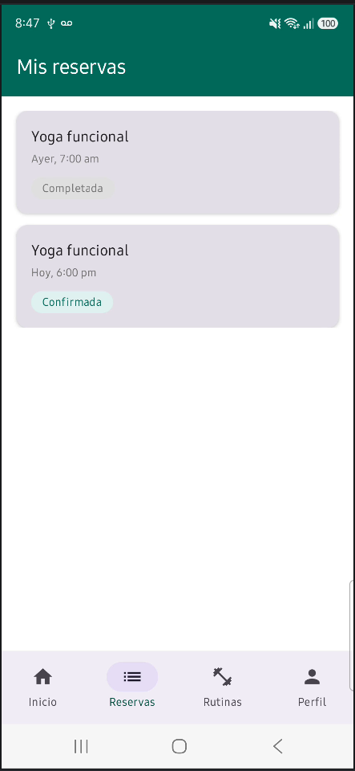
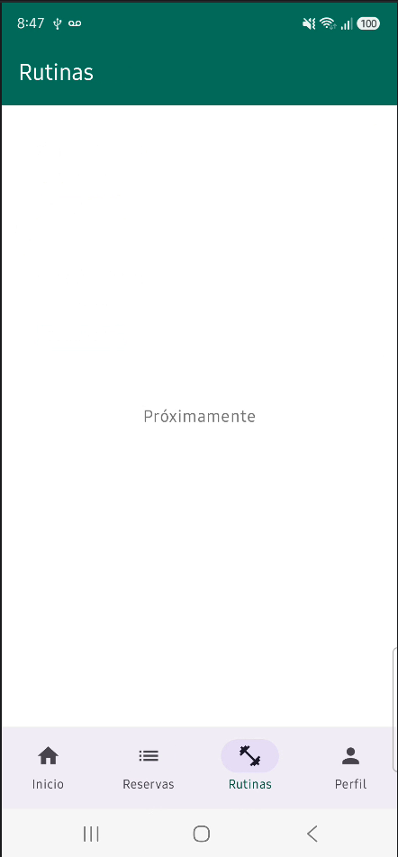
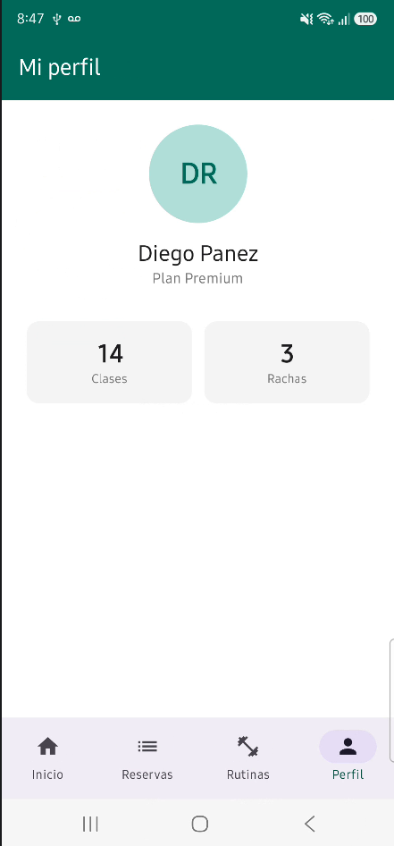

# TECSUP Fit — Programación en Móviles

App Android con Jetpack Compose para reservar clases de gimnasio.

## Estructura del proyecto

app/src/main/java/com/panez/tecsupfit/

├── MainActivity.kt

├── model/ → Clase, Reserva

├── data/ → DatosMock (listaClases, reservasAgendadas)

├── navigation/ → AppNavegacion (NavHost con 7 rutas)

├── screens/ → Inicio, Detalle, Reservar, Confirmacion, Reservas, Rutinas, Perfil, BottomBar

└── ui/theme/ → Colores verdes de TecsupFit


## Requerimientos Funcionales

| RF | Descripción | Archivo | Cómo verificarlo |
|----|-------------|---------|------------------|
| **RF1** | Filtrar clases por "Hoy" / "Esta semana" | `screens/InicioScreen.kt` | Toca un chip de filtro → se resalta la opción |
| **RF2** | Listar clases disponibles | `screens/InicioScreen.kt` | Al abrir la app se ven 3 clases con nombre y horario |
| **RF3** | Ver detalle de la clase seleccionada | `screens/DetalleClaseScreen.kt` | Toca una tarjeta → se abre el detalle con datos completos |
| **RF4** | Reservar cupo eligiendo horario | `screens/ReservarCupoScreen.kt` | En detalle, toca "Reservar cupo" → elige uno de los 3 horarios |
| **RF5** | Confirmar reserva con resumen | `screens/ConfirmacionScreen.kt` | Tras confirmar, se muestra clase + horario + sala |
| **RF6** | Navegar entre secciones con bottomBar | `screens/BottomBar.kt` | Cambia entre pestañas Inicio/Reservas/Rutinas/Perfil |
| **RF7** | Listar reservas con estado | `screens/ReservasScreen.kt` | Pestaña "Reservas" → lista con chip "Confirmada" o "Completada" |
| **RF8** | Ver perfil con estadísticas | `screens/PerfilScreen.kt` | Pestaña "Perfil" → avatar DR + clases + rachas |
| **RF9** | Ver rutinas | `screens/RutinasScreen.kt` | Pestaña "Rutinas" → lista de 3 rutinas con progreso |
| **RF10** | Cancelar reserva confirmada | `screens/ReservasScreen.kt` | Reservas → toca "Confirmada" → AlertDialog → "Sí, cancelar" → Snackbar "Reserva cancelada" |
| **RF11** | Indicador visual de cupos | `screens/DetalleClaseScreen.kt` | Detalle de clase → barra de progreso verde bajo el texto de cupos |
| **RF12** | Chips de disponibilidad | `screens/InicioScreen.kt` | Inicio → clases con ≤3 cupos muestran chip naranja; con 0 cupos muestran chip rojo |
| **RF13** | Cupos que bajan al reservar y bloqueo al agotarse | `data/DatosMock.kt` + `screens/ConfirmacionScreen.kt` | Reserva 1 clase → el cupo baja en Inicio; al llegar a 0 el botón se deshabilita |
| **RF14** | Rutinas con progreso y marcar como completada | `screens/RutinasScreen.kt` | Rutinas → "Completar" cambia chip a "Hecha" y sube la barra de progreso |
| **RF15** | Perfil dinámico: clases y rachas reactivas | `screens/PerfilScreen.kt` | Reservar suma 1 a "Clases"; cancelar resta; completar rutina suma a "Rachas" |
## Flujo de navegación

**Secuencial:** Inicio → Detalle de clase → Reservar cupo → Confirmación
**Secundaria (bottomBar):** Inicio / Reservas / Rutinas / Perfil

## Prompt utilizado
### Prompt 1 — Dinamismo completo de la app

**Prompt usado:**

```
Contexto del proyecto:
Estoy trabajando en una app Android con Jetpack Compose (Material 3) llamada
"TecsupFit" para reservar clases de gimnasio. Uso Navigation Compose con
bottomBar de 4 pestañas. NO uso ViewModel, todo el estado es con
remember/mutableStateOf.

Estructura actual del proyecto:
- model/Clase.kt (id, nombre, horario, sala, duracion, descripcion, cuposDisponibles, cuposTotales)
- model/Reserva.kt (clase: Clase, horario: String, estado: String)
- data/DatosMock.kt (listaClases, reservasAgendadas)
- screens/BottomBar.kt, InicioScreen.kt, DetalleClaseScreen.kt,
  ReservarCupoScreen.kt, ConfirmacionScreen.kt, ReservasScreen.kt,
  RutinasScreen.kt, PerfilScreen.kt
- navigation/AppNavegacion.kt
- ui/theme/Color.kt (VerdePrincipal, VerdeClaro, VerdeOscuro, VerdeChip,
  GrisTexto, GrisFondo)

Necesito que agregues las siguientes mejoras dinámicas:

1. CANCELAR RESERVA con AlertDialog en ReservasScreen.kt:
   - Al tocar reserva "Confirmada", aparece AlertDialog "¿Cancelar esta reserva?"
   - Botones "Sí, cancelar" (rojo) y "No"
   - Al confirmar, eliminar de reservasAgendadas y mostrar Snackbar
     "Reserva cancelada"
   - Reservas "Completadas" no se pueden cancelar

2. CUPOS DINÁMICOS:
   - Convertir listaClases a mutableStateListOf en DatosMock.kt
   - Al reservar en ConfirmacionScreen, restar 1 a cuposDisponibles
   - En DetalleClaseScreen, deshabilitar botón si cuposDisponibles == 0
     con texto "Sin cupos disponibles"
   - En ReservarCupoScreen, bloquear si la clase está agotada

3. CHIPS DE DISPONIBILIDAD en InicioScreen.kt:
   - Chip rojo "Sin cupos" si cuposDisponibles == 0
   - Chip naranja "Últimos cupos" si cuposDisponibles <= 3
   - Sin chip en caso normal

4. INDICADOR DE CUPOS en DetalleClaseScreen.kt:
   - LinearProgressIndicator debajo del texto de cupos
   - progreso = cuposDisponibles / cuposTotales

5. ANIMACIÓN en InicioScreen.kt:
   - AnimatedVisibility con fadeIn + slideInVertically en la LazyColumn

6. RUTINAS CON PROGRESO en RutinasScreen.kt:
   - Agregar model/Rutina.kt (id, nombre, duracion, ejercicios, completada)
   - Agregar listaRutinas en DatosMock.kt con 3 rutinas
   - Mostrar barra de progreso "X de Y completadas"
   - Botón "Completar" que cambia el estado y actualiza la UI

7. PERFIL DINÁMICO en PerfilScreen.kt:
   - Clases = count de reservasAgendadas con estado "Confirmada"
   - Rachas = count de listaRutinas con completada == true
   - Mensaje motivacional que cambia según cantidad de rachas

Restricciones:
- NO uses ViewModel, solo remember/mutableStateOf
- Mantén el diseño verde actual
- Compose BOM 2024.09.00 y Navigation Compose 2.8.0
- Dame el código completo de cada archivo modificado
```

**Respuesta de la IA:**

Gemini implementó las 7 mejoras:
- `ReservasScreen.kt` con estado `reservaACancelar`, `SnackbarHostState` y `AlertDialog`
- `ConfirmacionScreen.kt` con `LaunchedEffect` que resta cupo y agrega reserva
- `DetalleClaseScreen.kt` con `LinearProgressIndicator` y botón condicional
- `ReservarCupoScreen.kt` con bloqueo si clase agotada
- `InicioScreen.kt` con `AnimatedVisibility` y chips condicionales
- `RutinasScreen.kt` con `LazyColumn`, barra de progreso y botón "Completar"
- `PerfilScreen.kt` con contadores reactivos y mensaje motivacional
- `data/DatosMock.kt` con `mutableStateListOf` y `listaRutinas`
- `model/Rutina.kt` nuevo

**Correcciones que tuve que hacer:**

1. **`animateItemPlacement()` ya no existe en Compose 1.7+** — Gemini lo usó
   pero la API cambió de nombre a `animateItem()`.
   - **Solución:** eliminé la animación de items; dejé solo `AnimatedVisibility`
     con `fadeIn + slideInVertically` que sí compila.

2. **Versiones de `libs.versions.toml` incorrectas** — Gemini propuso versiones
   nuevas de AGP, Kotlin, Compose BOM que no aplican a mi proyecto.
   - **Solución:** NO reemplacé ese archivo; mantuve las versiones originales.

3. **Bug de navegación del bottomBar** — al reservar y volver a Inicio, la
   pantalla no cargaba porque `popUpTo + saveState=true` restauraba una pila
   inválida.
   - **Solución:** cambié a `saveState = false` en `BottomBar.kt`.

4. **Bug de reservas duplicadas** — `LaunchedEffect(claseId)` en
   `ConfirmacionScreen` se disparaba varias veces al recomponer.
   - **Solución:** cambié a `LaunchedEffect(Unit)` para que solo corra al montar.

5. **`@OptIn(ExperimentalFoundationApi::class)` mal aplicado** — Gemini puso la
   anotación en el archivo pero el compilador seguía fallando.
   - **Solución:** eliminé la dependencia de esa API experimental al quitar
     `animateItemPlacement()`.

---
## Capturas
|   Pantalla Inicio   |    Detalle de clase     |   Reservar cupo   |     Confirmación     |
|:-------------------:|:-----------------------:|:-----------------------:|:-----------------------:|
|  |  |  | |

|        Reservas         |         Rutinas         |         Perfil          |
|:-----------------------:|:-----------------------:|:-----------------------:|
|  |  |  |