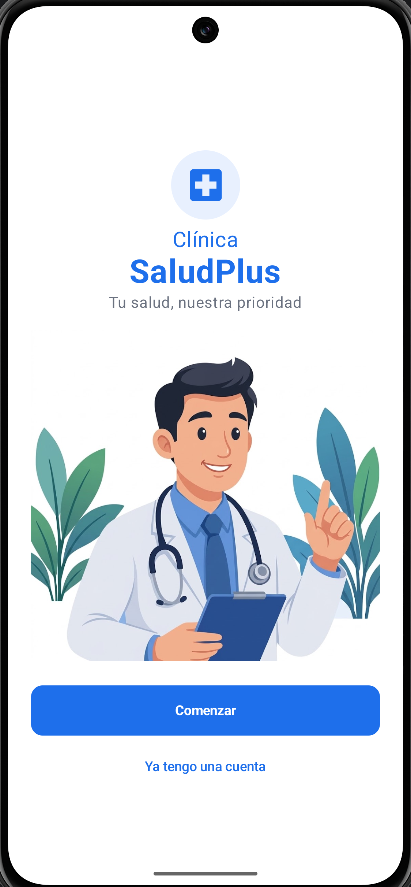
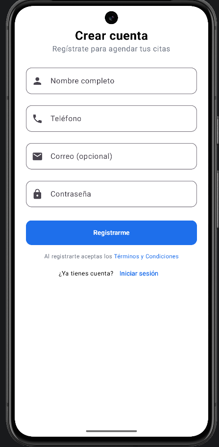
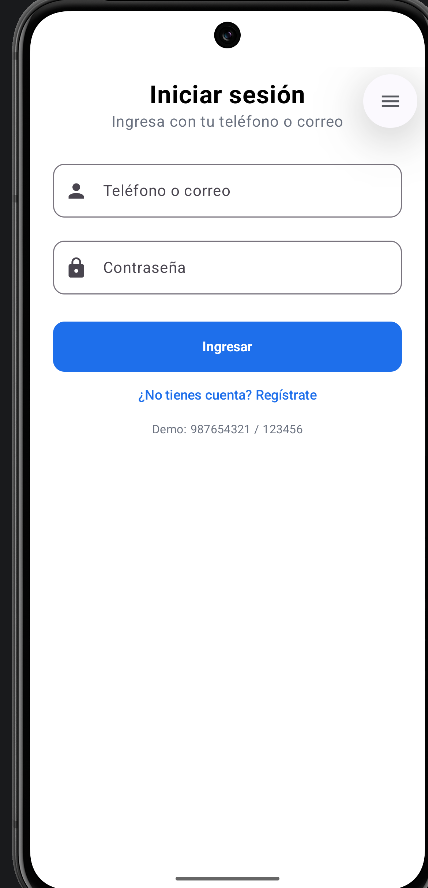
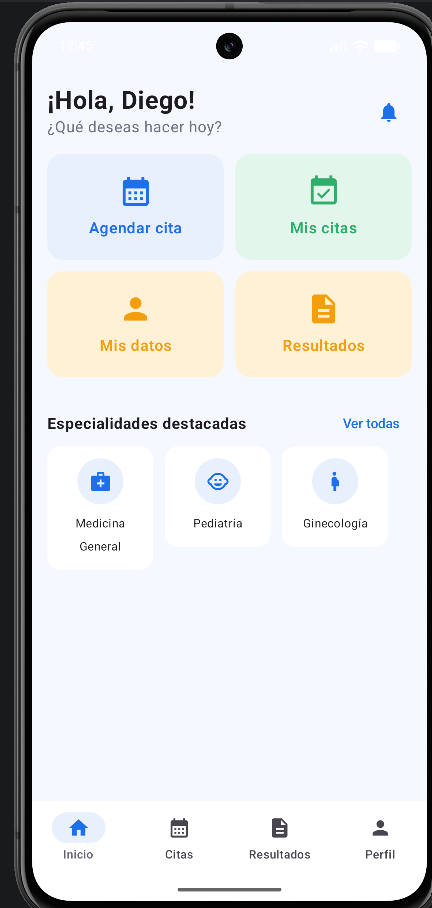
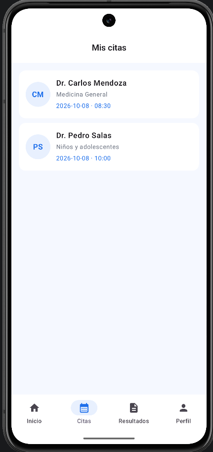
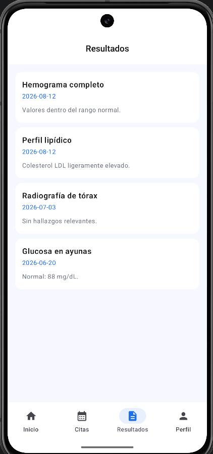
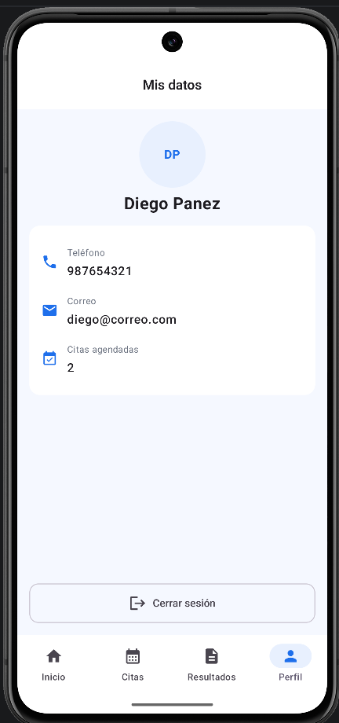
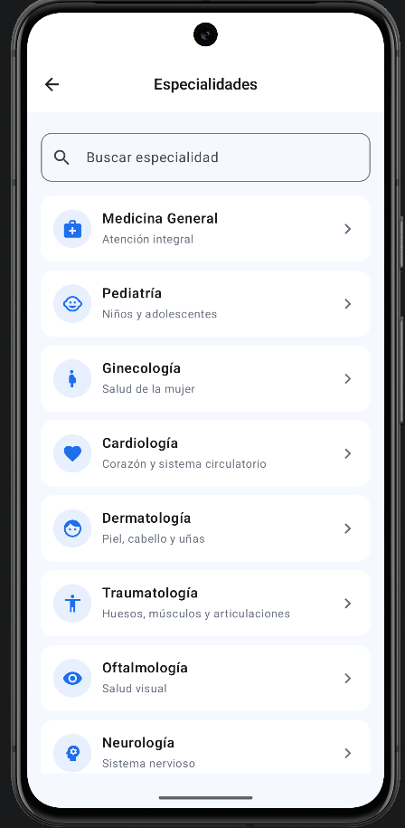
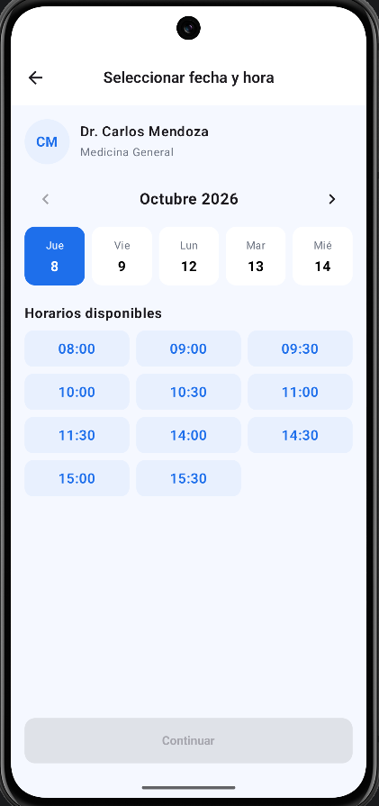
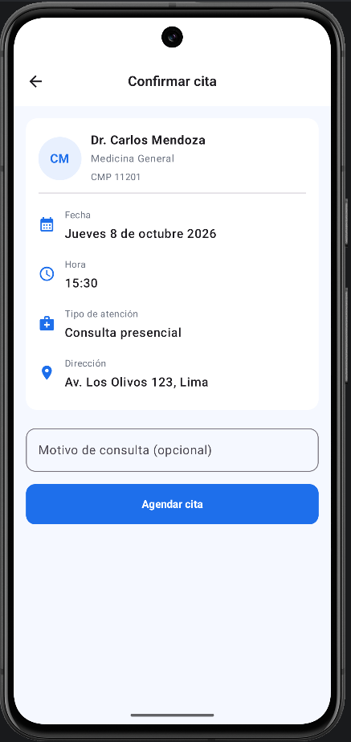

# SaludPlus Citas — App Paciente

App Android (Jetpack Compose) para agendar citas médicas en la Clínica SaludPlus. Los datos viven
en memoria dentro de `Repositorio` (sin base de datos), por lo que se pierden al cerrar la app.

**Usuario de prueba:** `987654321` / `123456`

## Ramas

- `sin-ia`: Fase 1, desarrollo propio sin asistente de IA.
- `con-ia`: Fase 2, mejora hecha con ayuda de IA (calendario dinámico).

## Fase 2 — Calendario dinámico (con IA)

- Muestra los próximos 5 días hábiles a partir de hoy con `java.time.LocalDate`.
- Las flechas `<` y `>` cambian de semana; no se puede retroceder antes de la semana actual.
- El mes y año del encabezado cambian según la semana mostrada.
- Al cambiar de día se recalculan los horarios disponibles y se reinicia la hora seleccionada.
- La pantalla de confirmación muestra la fecha en español ("Martes 16 de setiembre 2026").
- Se mantiene el bloqueo de horarios ya reservados.

## Prompts usados

### Prompt 1: Calendario dinámico y fecha en español

**Prompt:** Pasé a la IA el enunciado de la Fase 2: reemplazar la lista fija de días de la pantalla
Fecha y hora por un calendario dinámico con `java.time.LocalDate` (5 días hábiles desde hoy, flechas
por semana sin retroceder antes de la actual, mes y año dinámicos, reinicio de la hora al cambiar de
día y fecha en español en la Pantalla 7), sin romper el bloqueo de horarios reservados.

**Respuesta resumida:** La IA creó `FechaUtil.kt` con extensiones de `LocalDate` (días hábiles,
nombres de día y mes en español, `semanaHabil`), reescribió `FechaHoraScreen.kt` con el estado de la
semana, las flechas y el reinicio de la hora, y cambió `ConfirmarCitaScreen.kt` para mostrar la fecha
con `fechaLegible`.

**Qué tuve que corregir:**
- Mi proyecto usa minSdk 24, así que `java.time` necesita `coreLibraryDesugaring` en `build.gradle.kts`.
- Ajusté el formato de la fecha al del enunciado: "Martes 16 de setiembre 2026".
- (Agrega aquí cualquier otro error que te haya salido al probar en el emulador.)

### Prompt 2: Organizar los commits de la rama

**Prompt:** Pedí ayuda para partir del proyecto terminado de la Fase 1 y separar los cambios de la
Fase 2 en commits descriptivos en `con-ia`, sin mezclar commits de otros laboratorios.

**Respuesta resumida:** La IA indicó traer solo la carpeta `SaludPlusCitas` desde `sin-ia` con
`git checkout sin-ia -- <carpeta>` y propuso tres commits: utilidades de fecha y desugaring,
calendario dinámico con fecha en español, e imagen de inicio con este README.

**Qué tuve que corregir:** Adapté los comandos de PowerShell a Git Bash y agrupé los cambios en 3 commits.

### Prompt 3: Imagen en la pantalla de inicio

**Prompt:** Pedí cómo agregar la imagen del doctor del diseño de referencia a la pantalla Splash.

**Respuesta resumida:** La IA indicó copiar la imagen a `res/drawable` y mostrarla con `Image` y
`painterResource` en `SplashScreen.kt`.

**Qué tuve que corregir:** Cambié la primera imagen, que tenía un marco gris, por `doc.png`, que
tiene fondo blanco. Ajusté el tamaño con `aspectRatio` y centré el contenido para que la imagen no
quedara separada del texto y del botón.

## Preguntas de reflexión

### 1. ¿Por qué los modelos, Rutas.kt y AppNavigation.kt se entregaron completos y las pantallas no? ¿Qué tienen en común los archivos que sí se dejaron como esqueleto?

Creo que esos tres archivos son como el plano de la app: dicen qué datos existen (modelos) y a qué
pantalla se puede ir desde cuál (rutas y navegación). Tienen que estar bien hechos para que todo
funcione, pero no era lo que se quería practicar en este laboratorio. Lo que sí se dejó vacío (el
Repositorio y las pantallas) tiene algo en común: es donde uno tiene que pensar. Ahí se guardan los
datos, se busca, se filtra, se muestran listas y se reacciona a lo que toca el usuario. Esa es la
parte donde de verdad se aprende.

### 2. ¿Por qué el Repositorio es un object y no una clase normal? ¿Qué pasaría con las citas si cada pantalla creara su propia lista?

Es un `object` porque así hay una sola copia de los datos que usan todas las pantallas. Si cada
pantalla tuviera su propia lista, sería como si cada una tuviera su propio cuaderno: yo agendaría la
cita en la pantalla de Confirmar, pero Mis citas miraría otro cuaderno vacío y nunca la vería. Con
un solo `object`, todas leen y escriben en el mismo lugar y los datos coinciden en toda la app.

### 3. ¿Cómo lograste que la búsqueda de especialidades y los horarios disponibles se actualicen solos?

Guardé el texto del buscador y las listas de citas en variables que Compose "vigila" (`remember`
con `mutableStateOf` y `mutableStateListOf`). Cuando algo de eso cambia, por ejemplo cuando escribo
una letra o se agrega una cita, Compose vuelve a dibujar solo las partes que dependen de eso. Por
eso no tuve que decirle "actualiza la lista". Con los horarios pasa igual: la lista se calcula a
partir de las citas que ya existen, así que apenas se reserva una hora, desaparece sola.

### 4. ¿Qué diferencia notaste entre navigate() normal y el que usa popUpTo? ¿Qué pasa al presionar Atrás en cada caso?

Con el `navigate()` normal (Especialidades → Médicos) las pantallas se van apilando una encima de
otra, y al presionar Atrás vuelvo a la anterior. Con `popUpTo` (Confirmar cita → Cita agendada)
se borra todo el recorrido del agendamiento (Especialidades, Médicos, Fecha y hora, Confirmar).
Entonces, al presionar Atrás desde Cita agendada, voy directo al Inicio y no regreso a Confirmar,
donde podría agendar la misma cita otra vez por error.

### 5. ¿Qué tuviste que corregir del código que te generó la IA para el calendario dinámico?

- Mi proyecto tiene minSdk 24, y `java.time` no funciona bien ahí sin una configuración extra. Tuve
  que activar `coreLibraryDesugaring` en `build.gradle.kts`.
- El formato de la fecha no coincidía con el del enunciado, así que lo ajusté a
  "Martes 16 de setiembre 2026".
- (Agrega aquí algo que te haya pasado de verdad al probar en el emulador.)

### 6. Compara el NavigationDrawer del Laboratorio 6 con el NavigationBar de esta tarea: ¿en qué caso usarías cada uno en un proyecto propio?

El NavigationBar (la barra de abajo) lo usaría cuando la app tiene pocas secciones principales, de
3 a 5, que la gente usa todo el tiempo, como Inicio, Citas, Resultados y Perfil aquí. Queda a la
mano del pulgar y se ve de un vistazo. El NavigationDrawer (el menú lateral) lo usaría cuando la
app tiene muchas secciones o algunas que se usan poco, como en la tienda del Laboratorio 6, con
pedidos, favoritos, perfil y cerrar sesión. Ahí es mejor esconderlas en un menú para no llenar la
pantalla. En un proyecto propio de citas médicas usaría la barra de abajo. En uno con muchas
opciones de administración usaría el menú lateral, o los dos juntos.

## Capturas de pantalla
    

    